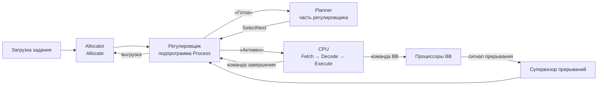

<div align="center">

# Модель операционной системы

**Вариант 11 · относительные и динамические приоритеты**

[](https://go.dev)
[](https://wails.io)


Учебная модель ОС с нативным интерфейсом: задания генерируются и загружаются
в память, планируются по динамическим относительным приоритетам и выполняются
на моделируемом фон-неймановском процессоре. Операции ввода-вывода обслуживают
процессоры ВВ, сигналы прерываний обрабатывает супервизор прерываний.

</div>


## ✨ Возможности

- **Генерация и загрузка заданий** — случайные параметры (размер, число команд,
  процент IO, базовый приоритет), проверка свободной памяти и места в таблице PSW.
- **Диспетчеризация по варианту 11** — относительные динамические приоритеты:
  активный процесс не вытесняется, приоритет растущих заданий увеличивается.
- **Фон-неймановский процессор** — `Fetch → PC+1 → Decode → Execute`, АЛУ
  выполняет двухместные операции над операндами из аппаратной памяти.
- **Регулировщик состояний** — состояния «Готов», «Активен», «Инициализация IO»,
  «Блокирован» изменяет только регулировщик (подпрограмма `Process`).
- **Ввод-вывод и прерывания** — каждой операции выделяется отдельный процессор ВВ
  (очереди к ним не моделируются); по окончании формируется сигнал прерывания,
  который обрабатывает супервизор прерываний.
- **Дашборд в реальном времени** — состояние ЦПр, память, очереди готовности,
  процессоры ВВ, журнал прерываний, полная таблица PSW, модельное время и скорость.
- **Директивы оператора** — пауза, изменение скорости (0,1…1000 такт/с),
  завершение моделирования.

## 🧠 Как работает диспетчеризация

| Правило | Формула |
|---|---|
| Выбор процесса | `P = argmax(DynamicPriority)` — только при освобождении ЦПр |
| Приоритет (вариант 11) | `DynamicPriority += Task.Size` каждый такт в очереди |
| Свободная память | `Free = Total − Used` |

Планировщик вызывается в шаге «Проверка состояния системы»: когда активный
процесс заблокировался или завершился, либо когда ЦПр простаивает, а в очереди
появился готовый процесс (например, после прерывания от процессора ВВ).
Только регулировщик изменяет состояния процессов — планировщик лишь выбирает
номер процесса (`SelectNext`).

## 🔄 Состояния, регулировщик и прерывания

Состояния процесса: «Готов», «Активен», «Инициализация IO», «Блокирован».
Изменять состояние имеет право только **регулировщик** — подпрограмма
`Process(p, event)` в `internal/regulator`; процессор, подсистема ВВ и
планировщик лишь сообщают о событиях.

| Событие | Переход состояния |
|---|---|
| Загрузка задания | → «Готов» |
| Выбор планировщика | «Готов» → «Активен» |
| Команда ввода-вывода | «Активен» → «Инициализация IO» |
| Процессор ВВ начал операцию | «Инициализация IO» → «Блокирован» |
| Прерывание от ВВ | «Блокирован» → «Готов» |
| Команда завершения | выгрузка (память + запись PSW) |

По окончании операции процессор ВВ формирует **сигнал прерывания**
(`Post` в `internal/interrupt`). Супервизор прерываний извлекает сигналы
(`ExtractAll`) и через регулировщик возвращает процессы в очередь готовности.
Ход операции ВВ (номер процессора ВВ и счётчик тактов) хранится в состоянии
процессора ВВ; в PSW остаётся только состояние процесса — дублирования нет.

## ⏱ Такт моделирования

| Шаг | Действие |
|---|---|
| А | Инициализация цикла: выбор процесса, «Активен», восстановление PSW |
| Б1 | ЦПр выполняет очередную команду активного процесса |
| Б2 | Такт каждого процессора ВВ + обработка прерываний от ВВ |
| Б3 | Прерывания по времени — не моделируются (вариант 11: без вытеснения) |
| Б4 | Проверка состояния системы: диспетчеризация, загрузка нового задания |
| Б5 | Обновление баз данных: пересчёт динамических приоритетов |
| Б6 | Отображение изменений в состоянии системы |

## 🏗 Архитектура



| Модуль | Назначение |
|---|---|
| `internal/process` | `Task` (задание) и `PSW` (слово состояния процесса) |
| `internal/memory` | супервизор памяти: учёт свободной и занятой памяти |
| `internal/regulator` | регулировщик: единственная точка смены состояний процессов, включает планировщик `Planner` (вариант 11) |
| `internal/cpu` | процессор, АЛУ, команды и аппаратная память операндов |
| `internal/io` | процессоры ввода-вывода и сигналы по окончании операций |
| `internal/interrupt` | супервизор прерываний: накопление и обработка сигналов |
| `internal/os` | ядро: главный цикл, генерация заданий, директивы, снимки состояния |

## 🚀 Запуск

```sh
# Режим разработки (горячая перезагрузка)
wails dev -tags webkit2_41

# Сборка приложения
wails build -tags webkit2_41
./build/bin/os_model

# Консольный режим без интерфейса
go run ./cmd/osmodel
```

> Тег `webkit2_41` нужен для систем с WebKitGTK 4.1 (Ubuntu 22.04+, Fedora).
> На старых системах с WebKitGTK 4.0 собирайте без тега: `wails build`.

## ⌨️ Управление

| Клавиша | Действие |
|---|---|
| `Space` | пауза / продолжить |
| `+` / `−` | изменить скорость на 10 % |
| `Q` | завершить моделирование |

## 📁 Структура проекта

```
os_model/
├── main.go / app.go     # окно Wails и мост «ядро — интерфейс»
├── wails.json           # конфигурация Wails (фронтенд без сборки)
├── frontend/dist/       # интерфейс: HTML / CSS / JS
├── cmd/osmodel/         # консольный запуск ядра
├── internal/
│   ├── process/         # задания и слова состояний процессов
│   ├── memory/          # супервизор памяти (учёт памяти)
│   ├── regulator/       # регулировщик: состояния процессов и планировщик
│   ├── cpu/             # процессор и АЛУ
│   ├── io/              # процессоры ввода-вывода
│   ├── interrupt/       # супервизор прерываний
│   └── os/              # ядро системы и снимки состояния
├── docs/                # задания к лабораторным работам
├── image.png            # скриншот интерфейса
└── go.mod
```

---

<div align="center">

Сделано в рамках лабораторных работ по дисциплине «Операционные системы» · ЧувГУ

</div>
