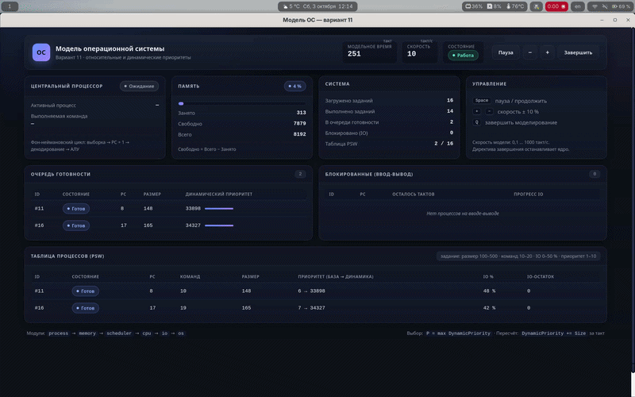
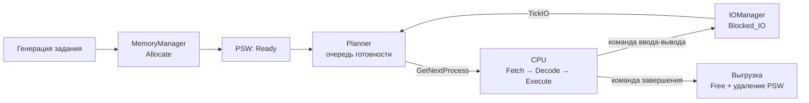

<div align="center">

# Модель операционной системы

**Вариант 11 · относительные и динамические приоритеты**

[](https://go.dev)
[](https://wails.io)


Учебная модель ОС с нативным интерфейсом: задания генерируются и загружаются
в память, планируются по динамическим относительным приоритетам и выполняются
на моделируемом фон-неймановском процессоре. Ввод-вывод моделирует подсистема IO.

</div>



## ✨ Возможности

- **Генерация и загрузка заданий** — случайные параметры (размер, число команд,
  процент IO, базовый приоритет), проверка свободной памяти и места в таблице PSW.
- **Диспетчеризация по варианту 11** — относительные динамические приоритеты:
  активный процесс не вытесняется, приоритет растущих заданий увеличивается.
- **Фон-неймановский процессор** — `Fetch → PC+1 → Decode → Execute`, АЛУ
  выполняет двухместные операции над операндами из аппаратной памяти.
- **Моделирование ввода-вывода** — процесс блокируется на N тактов и
  возвращается в очередь готовности по сигналу окончания IO.
- **Дашборд в реальном времени** — состояние ЦПр, память, очереди готовности
  и блокировки, полная таблица PSW, модельное время и скорость.
- **Директивы оператора** — пауза, изменение скорости (0,1…1000 такт/с),
  завершение моделирования.

## 🧠 Как работает диспетчеризация

| Правило | Формула |
|---|---|
| Выбор процесса | `P = argmax(DynamicPriority)` — только при освобождении ЦПр |
| Приоритет (вариант 11) | `DynamicPriority += Task.Size` каждый такт в очереди |
| Свободная память | `Free = Total − Used` |

Планировщик вызывается, когда активный процесс обратился к вводу-выводу или
завершился, либо когда ЦПр простаивает, а в очереди появился готовый процесс.

## 🏗 Архитектура



| Модуль | Назначение |
|---|---|
| `internal/process` | `Task` (задание) и `PSW` (слово состояния процесса) |
| `internal/memory` | учёт свободной и занятой памяти |
| `internal/scheduler` | очередь готовности и алгоритм диспетчеризации |
| `internal/cpu` | процессор, АЛУ, команды и аппаратная память операндов |
| `internal/io` | блокировка процессов и отсчёт тактов ввода-вывода |
| `internal/os` | ядро: главный цикл, генерация заданий, директивы, снимки состояния |

## 🚀 Запуск

```sh
# Режим разработки (горячая перезагрузка)
wails dev -tags webkit2_41

# Сборка приложения
wails build -tags webkit2_41
./build/bin/os_model

# Консольный режим без интерфейса
go run ./cmd/osmodel
```

> Тег `webkit2_41` нужен для систем с WebKitGTK 4.1 (Ubuntu 22.04+, Fedora).
> На старых системах с WebKitGTK 4.0 собирайте без тега: `wails build`.

## ⌨️ Управление

| Клавиша | Действие |
|---|---|
| `Space` | пауза / продолжить |
| `+` / `−` | изменить скорость на 10 % |
| `Q` | завершить моделирование |

## 📁 Структура проекта

```
os_model/
├── main.go / app.go     # окно Wails и мост «ядро — интерфейс»
├── wails.json           # конфигурация Wails (фронтенд без сборки)
├── frontend/dist/       # интерфейс: HTML / CSS / JS
├── cmd/osmodel/         # консольный запуск ядра
├── internal/
│   ├── process/         # задания и слова состояний процессов
│   ├── memory/          # менеджер памяти
│   ├── scheduler/       # планировщик (вариант 11)
│   ├── cpu/             # процессор и АЛУ
│   ├── io/              # подсистема ввода-вывода
│   └── os/              # ядро системы и снимки состояния
├── docs/                # задания к лабораторным работам
├── image.png            # скриншот интерфейса
└── go.mod
```

---

<div align="center">

Сделано в рамках лабораторных работ по дисциплине «Операционные системы» · ЧувГУ

</div>
